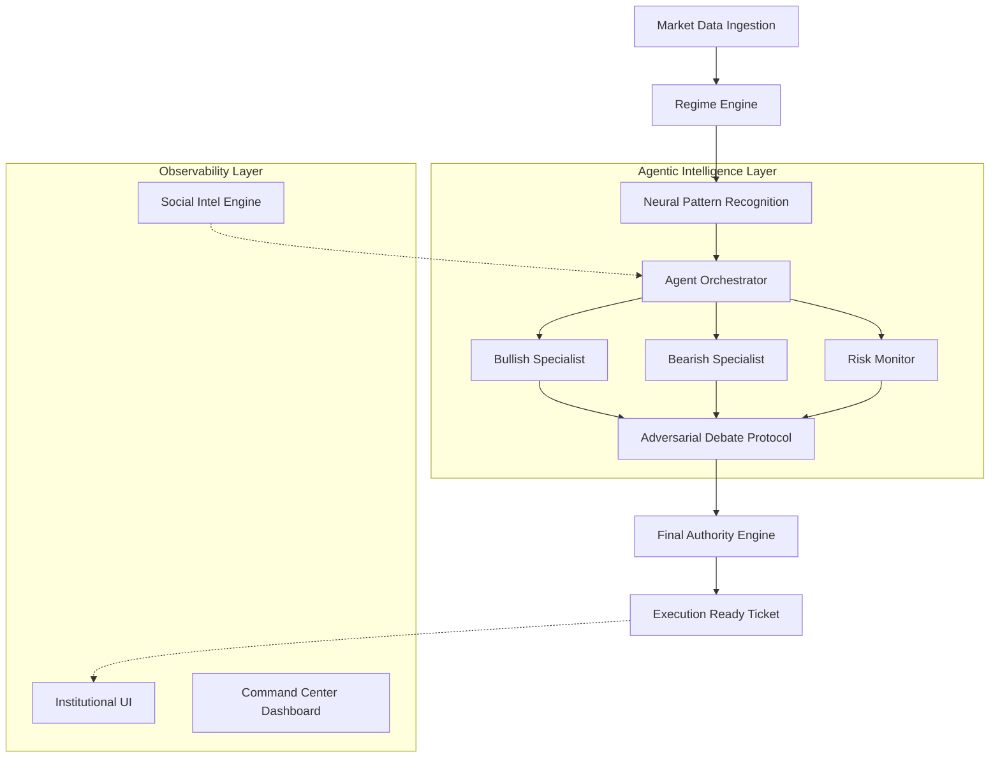

# BETA: Institutional Quantitative Intelligence OS

[](#system-architecture)
[](LICENSE)
[](https://www.python.org/)

> **Autonomous Multi-Asset Intelligence for Terminal-First Financial Research.**

BETA is a high-performance quantitative operating system designed for terminal-based financial research, risk management, and strategy execution. It bridges the gap between raw market telemetry and actionable institutional trade planning through an adversarial multi-agent architecture.

---

## Core Platform Features

### Institutional Execution Suite
- **RiskEngine**: Automated position sizing based on fractional capital risk and current account balance.
- **Statistical Modeling**: Volatility-adjusted ATR-based Stop Losses and Multi-Tier Take Profit levels.
- **High-Fidelity Tickets**: Synthesis of complete trade tickets including Lot Sizing, Entry Strategy, and real-time R:R Ratio validation.

### Advanced Quantitative Visuals
- **Tracer Charts**: Institutional ASCII charts featuring dashed historical trails and real-time structural mapping.
- **Volatility Heatmaps**: Cross-asset risk intensity matrices to identify market-wide stress.
- **Correlation Matrices**: Statistical coupling detection across FX, Commodities, and Crypto.

### Social Intelligence Engine
- **ML-Driven Sentiment**: BERT-based classification of signals from Reddit, Discord, Telegram, and Professional feeds.
- **Institutional Weighting**: Advanced signal filtering to prioritize "Whale" activity and institutional bias.

---

## Command Center Reference

Launch the interactive command center:
```bash
python src/beta/main.py
```

### Intelligence Commands
| Command | Feature | Output |
| :--- | :--- | :--- |
| `scan` | Global Market Scanner | Multi-asset regime matrix & opportunity scan. |
| `setup` | Institutional Ticket | Statistical Entry/SL/TP & Lot Sizing. |
| `dashboard` | Command Center | Real-time multi-pane operational workstation. |
| `analyze` | Quant Suite | Volatility Heatmaps & Correlation Matrices. |
| `sentiment` | Social Intel | ML-weighted institutional sentiment aggregation. |

---

## System Architecture

BETA is a distributed, multi-agent quantitative intelligence operating system. It utilizes an **Adversarial Reasoning** framework where specialized agents compete to validate trade hypotheses before execution authorization.

### High-Level Design (Agentic Topology)



### Core Components & Sub-Systems

#### 1. The Adversarial Agent Layer
- **Orchestrator**: Manages the lifecycle and state of specialized neural agents.
- **Debate Protocol**: A multi-turn adversarial reasoning loop. Agents present conflicting evidence (Bullish vs. Bearish) while a **Risk Monitor** adjudicates the final conviction score based on the "Strength of Signal".
- **Specialists**: Agents utilize HMM-based (Hidden Markov Model) regime detection and volume-weighted structural analysis.

#### 2. Risk & Authority Engine
- **Final Authority (Circuit Breaker)**: A hard-coded validation layer that rejects trade setups exceeding institutional parameters (e.g., Max Drawdown, Min R:R, Regime Conflict).
- **Fractional Risk Engine**: Automatically synthesizes lot sizing based on account equity, ATR-adjusted volatility, and user risk settings.

#### 3. Observability & Command Suite
- **Cyber-Minimalist CLI**: A high-density information display optimized for keyboard-first operation and low-latency feedback.
- **Neural Stream**: Real-time logging of the agentic "thought process" and debate turns.
- **Institutional UI**: Professional ASCII-based structural charts and cross-asset volatility matrices.

---

"Standardizing the chaos of market data."
